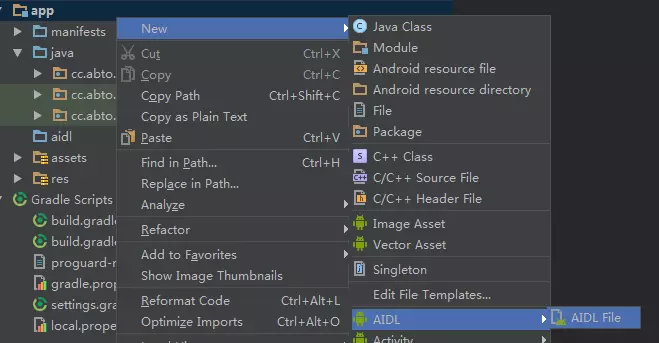

###基本概念与问题的提出：

1. 进程是程序的一个运行实例，以区别于"程序这一静态概念；而线程则是CPU调度的基本的单位。

2. 如果两个对象处于同一个进程空间中，那么内存区域应该是可以共享的(操作系统基本知识) 
   也就是不同进程间内存区域是不共享的，并不是不同的"程序"
  
3. 同时在官网，我们可以找到下面这句话：
 > By default, all components of the same application run in the same process and most applications should not change this. However, if you find that you need to control which process a certain component belongs to, you can do so in the manifest file.
 [官网介绍地址](https://stuff.mit.edu/afs/sipb/project/android/docs/guide/components/processes-and-threads.html)
  
 上面的文档告诉我们，我们所创建的四大组件默认都在主线程中
 
 Tips：我们可以通过 android:process 来给Activity配置一个单独的进程。[官网介绍地址](https://developer.android.google.cn/guide/topics/manifest/activity-element?hl=zh-cn#proc)
  
4.基本验证

  创建三个Activity，基本代码如下：

	public class MainActivity extends AppCompatActivity {
	
	    public static final String TAG = "print_value";
	    public static int value = -1;
	
	    @Override
	    protected void onCreate(Bundle savedInstanceState) {
	        super.onCreate(savedInstanceState);
	        setContentView(R.layout.activity_main);
	
	        setTitle("MainActivity");
	
	        findViewById(R.id.to_next_activity).setOnClickListener(new OnClickListener() {
	            @Override
	            public void onClick(View view) {
	                value = 1;
	                Log.i(TAG, value + "=====to==Main2Activity===========");
	                Intent intent = new Intent(MainActivity.this, Main2Activity.class);
	                startActivity(intent);
	            }
	        });
	        findViewById(R.id.to_next_activity2).setOnClickListener(new OnClickListener() {
	            @Override
	            public void onClick(View view) {
	                value = 2;
	                Log.i(TAG, value + "====to=====Main3Activity=========");
	                Intent intent = new Intent(MainActivity.this, Main3Activity.class);
	                startActivity(intent);
	            }
	        });
	    }
	}
	
	public class Main2Activity extends AppCompatActivity {
	
	    @Override
	    protected void onCreate(Bundle savedInstanceState) {
	        super.onCreate(savedInstanceState);
	        setContentView(R.layout.activity_main2);
	
	        setTitle("Main2Activity");
	
	
	        Log.i(TAG, value + "=====this==Main2Activity===========");
	    }
	}
	public class Main3Activity extends AppCompatActivity {
	
	    @Override
	    protected void onCreate(Bundle savedInstanceState) {
	        super.onCreate(savedInstanceState);
	        setContentView(R.layout.activity_main3);
	
	        setTitle("Main3Activity");
	        Log.i(TAG, value + "=====this==Main3Activity===========");
	
	
	    }
	}

清单配置

	  <activity
	      android:name=".Main3Activity"
	      android:process=":remote" />
	  <activity android:name=".Main2Activity" />
	  <activity android:name=".MainActivity">
	      <intent-filter>
	          <action android:name="android.intent.action.MAIN" />
	
	          <category android:name="android.intent.category.LAUNCHER" />
	      </intent-filter>
	  </activity>

 注意Main3Activity的清单配置

 我们将得到如下打印：

  1=====to==Main2Activity=========== 
  1=====this==Main2Activity=========== 
  2====to=====Main3Activity========= 
  -1=====this==Main3Activity===========（得到如下打印，记得切换Logcat的展示进程） 

 结论： 这个打印足以证明多进程之前内存区域不共享 

常见的跨进程方式有：

AIDL ，Messager，Broadcast，ContentProvider ，甚至还可以使用文件和Scoket

针对几种方式，《Android艺术开发探索》提供了如下对比图

另外针对绑定服务和对象，官方文档也为我们提供了明确的说明：

针对绑定服务
[绑定服务概览](https://developer.android.google.cn/guide/components/bound-services?hl=zh-cn)
针对对象
[Parcelable 和 Bundle](https://developer.android.google.cn/guide/components/activities/parcelables-and-bundles?hl=zh-cn)
 
 Binder 事务缓冲区的大小固定有限，目前为 1MB，由进程中正在处理的所有事务共享。由于此限制是进程级别而不是 Activity 级别的限制，因此这些事务包括应用中的所有 binder 事务，例如 onSaveInstanceState，startActivity 以及与系统的任何互动。超过大小限制时，将引发 TransactionTooLargeException。
### AIDL的介绍
 
#####1. 基本定义： 
AIDL是Android Interface Definition Languagee的缩写。从名称看它是一种语言，而且是专门用于描述接口的语言。准确的来说，他是用于定义客户端、度无端通信接口的一种描述语言。

#####2. [基本使用](https://developer.android.google.cn/guide/components/aidl?hl=zh_cn) 
2.1 调用 IPC 方法,如要调用通过 AIDL 定义的远程接口，调用类必须执行以下步骤： 
 2.1.1 在项目的 src/ 目录中加入 .aidl 文件。 
 2.1.2 声明一个 IBinder 接口实例（基于 AIDL 生成）。 
 2.1.3 实现 ServiceConnection。 
 2.1.4 调用 Context.bindService()，从而传入您的 ServiceConnection 实现。 
      在 onServiceConnected() 实现中，您将收到一个 IBinder 实例（名为 service）。调用 YourInterfaceName.Stub.asInterface((IBinder)service)，以将返回的参数转换为 YourInterface 类型。
调用您在接口上定义的方法。您应始终捕获 DeadObjectException 异常，系统会在连接中断时抛出此异常。您还应捕获 SecurityException 异常，当 IPC 方法调用中两个进程的 AIDL 定义发生冲突时，系统会抛出此异常。
如要断开连接，请使用您的接口实例调用 Context.unbindService()。
   
2.2 创建 

通过上面的方式，系统将帮我们生成如下模板代码：
   
	  // Add.aidl
	  package me.fenfei.app.aidl;
	  
	  // Declare any non-default types here with import statements
	  interface Add {
	      /**
	       * Demonstrates some basic types that you can use as parameters
	       * and return values in AIDL.
	       */
	      void basicTypes(int anInt, long aLong, boolean aBoolean, float aFloat,
	              double aDouble, String aString);
	  }

清空body，定义我们的业务需求方法
	
	   // Add.aidl
	   package me.fenfei.app.aidl;
	   
	   // Declare any non-default types here with import statements
	   interface Add {
	   //此处简单的定义了两个数相加并返回相加的和
	      int add(int a,int b);
	   }

执行Rebulid Project。在工程的下面路径下，相同的包名内；将看到系统工具为我们生成的对应 Add.aidl的 Add.java 类
  
	/build/generated/aidl_source_output_dir/debug/compileDebugAidl/out

代码如下：

	/*
	 * This file is auto-generated.  DO NOT MODIFY.
	 */
	package me.fenfei.app.aidl;
	// Declare any non-default types here with import statements
	
	public interface Add extends android.os.IInterface
	{
	  /** Default implementation for Add. */
	  public static class Default implements me.fenfei.app.aidl.Add
	  {
	    @Override public int add(int a, int b) throws android.os.RemoteException
	    {
	      return 0;
	    }
	    @Override
	    public android.os.IBinder asBinder() {
	      return null;
	    }
	  }
	  /** Local-side IPC implementation stub class. */
	  public static abstract class Stub extends android.os.Binder implements me.fenfei.app.aidl.Add
	  {
	    private static final java.lang.String DESCRIPTOR = "me.fenfei.app.aidl.Add";
	    /** Construct the stub at attach it to the interface. */
	    public Stub()
	    {
	      this.attachInterface(this, DESCRIPTOR);
	    }
	    /**
	     * Cast an IBinder object into an me.fenfei.app.aidl.Add interface,
	     * generating a proxy if needed.
	     */
	    public static me.fenfei.app.aidl.Add asInterface(android.os.IBinder obj)
	    {
	      if ((obj==null)) {
	        return null;
	      }
	      android.os.IInterface iin = obj.queryLocalInterface(DESCRIPTOR);
	      if (((iin!=null)&&(iin instanceof me.fenfei.app.aidl.Add))) {
	        return ((me.fenfei.app.aidl.Add)iin);
	      }
	      return new me.fenfei.app.aidl.Add.Stub.Proxy(obj);
	    }
	    @Override public android.os.IBinder asBinder()
	    {
	      return this;
	    }
	    @Override public boolean onTransact(int code, android.os.Parcel data, android.os.Parcel reply, int flags) throws android.os.RemoteException
	    {
	      java.lang.String descriptor = DESCRIPTOR;
	      switch (code)
	      {
	        case INTERFACE_TRANSACTION:
	        {
	          reply.writeString(descriptor);
	          return true;
	        }
	        case TRANSACTION_add:
	        {
	          data.enforceInterface(descriptor);
	          int _arg0;
	          _arg0 = data.readInt();
	          int _arg1;
	          _arg1 = data.readInt();
	          int _result = this.add(_arg0, _arg1);
	          reply.writeNoException();
	          reply.writeInt(_result);
	          return true;
	        }
	        default:
	        {
	          return super.onTransact(code, data, reply, flags);
	        }
	      }
	    }
	    private static class Proxy implements me.fenfei.app.aidl.Add
	    {
	      private android.os.IBinder mRemote;
	      Proxy(android.os.IBinder remote)
	      {
	        mRemote = remote;
	      }
	      @Override public android.os.IBinder asBinder()
	      {
	        return mRemote;
	      }
	      public java.lang.String getInterfaceDescriptor()
	      {
	        return DESCRIPTOR;
	      }
	      @Override public int add(int a, int b) throws android.os.RemoteException
	      {
	        android.os.Parcel _data = android.os.Parcel.obtain();
	        android.os.Parcel _reply = android.os.Parcel.obtain();
	        int _result;
	        try {
	          _data.writeInterfaceToken(DESCRIPTOR);
	          _data.writeInt(a);
	          _data.writeInt(b);
	          boolean _status = mRemote.transact(Stub.TRANSACTION_add, _data, _reply, 0);
	          if (!_status && getDefaultImpl() != null) {
	            return getDefaultImpl().add(a, b);
	          }
	          _reply.readException();
	          _result = _reply.readInt();
	        }
	        finally {
	          _reply.recycle();
	          _data.recycle();
	        }
	        return _result;
	      }
	      public static me.fenfei.app.aidl.Add sDefaultImpl;
	    }
	    static final int TRANSACTION_add = (android.os.IBinder.FIRST_CALL_TRANSACTION + 0);
	    public static boolean setDefaultImpl(me.fenfei.app.aidl.Add impl) {
	      if (Stub.Proxy.sDefaultImpl == null && impl != null) {
	        Stub.Proxy.sDefaultImpl = impl;
	        return true;
	      }
	      return false;
	    }
	    public static me.fenfei.app.aidl.Add getDefaultImpl() {
	      return Stub.Proxy.sDefaultImpl;
	    }
	  }
	  public int add(int a, int b) throws android.os.RemoteException;
	}

	
	public class Main4Activity extends AppCompatActivity {
	
	    private Add mAdd;
	
	    @Override
	    protected void onCreate(Bundle savedInstanceState) {
	        super.onCreate(savedInstanceState);
	        setContentView(R.layout.activity_main4);
	       
	        bindService();
	
	        findViewById(R.id.sum_bt).setOnClickListener(new View.OnClickListener() {
	            @Override
	            public void onClick(View view) {
	                try {
	                    int  sum = mAdd.add(1, 1);
	                    Log.i(TAG, "====sum = " + sum);
	
	                } catch (RemoteException e) {
	                    e.printStackTrace();
	                }
	            }
	        });
	    }
	    private void bindService() {
	
	        Intent intent = new Intent();
	        Class clazz = DoService.class;
	        intent.setClassName(clazz.getPackage().getName(), clazz.getName());
	        bindService(intent, new ServiceConnection() {
	            @Override
	            public void onServiceConnected(ComponentName name, IBinder service) {
	                mAdd = Add.Stub.asInterface(service);
	
	            }
	            @Override
	            public void onServiceDisconnected(ComponentName name) {
	
	            }
	        }, BIND_AUTO_CREATE);
	    }
	}

可能有同学会说，我直接调用不行吗？为什么非得这样写，在同一个app里面又不是访问不到

public class Main4Activity extends AppCompatActivity {

    @Override
    protected void onCreate(Bundle savedInstanceState) {
        super.onCreate(savedInstanceState);
        setContentView(R.layout.activity_main4);
        
        bindService();

        findViewById(R.id.sum_bt).setOnClickListener(new View.OnClickListener() {
            @Override
            public void onClick(View view) {
                try {
                    int  sum = stubBinder.add(1, 1);
                    Log.i(TAG, "====sum = " + sum);
                } catch (RemoteException e) {
                    e.printStackTrace();
                }
            }
        });
    }

    private DoService.StubBinder stubBinder;

    private void bindService2() {
        Intent intent = new Intent(this, DoService.class);
        bindService(intent, new ServiceConnection() {
            @Override
            public void onServiceConnected(ComponentName name, IBinder service) {
                try {
                    stubBinder = (DoService.StubBinder) service;
                } catch (Exception e) {
                    e.printStackTrace();
                }
            }

            @Override
            public void onServiceDisconnected(ComponentName name) {

            }
        }, BIND_AUTO_CREATE);
    }
}

如果你按照上面的写法去写，你将得到下面的错误
	
	java.lang.ClassCastException: android.os.BinderProxy cannot be cast to me.fenfei.app.test2.DoService$StubBinder
	    at me.fenfei.app.test2.Main4Activity$3.onServiceConnected(Main4Activity.java:87)
	    at android.app.LoadedApk$ServiceDispatcher.doConnected(LoadedApk.java:1730)
	    at android.app.LoadedApk$ServiceDispatcher$RunConnection.run(LoadedApk.java:1762)
	    at android.os.Handler.handleCallback(Handler.java:873)
	    at android.os.Handler.dispatchMessage(Handler.java:99)
	    at android.os.Looper.loop(Looper.java:193)
	    at android.app.ActivityThread.main(ActivityThread.java:6669)
	    at java.lang.reflect.Method.invoke(Native Method)
	    at com.android.internal.os.RuntimeInit$MethodAndArgsCaller.run(RuntimeInit.java:493)
	    at com.android.internal.os.ZygoteInit.main(ZygoteInit.java:858)
	    
	    
    
可以看到在跨进程通讯的时候，我们得到的不是原始对象，而是一个代理对象，这个代理对象作为一个中间桥梁帮助我们进行通讯
    
还有另外一条是，在跨进程，多app的时候，我们是获取不到DoService这个类的，这个类只存在某一个apk中
